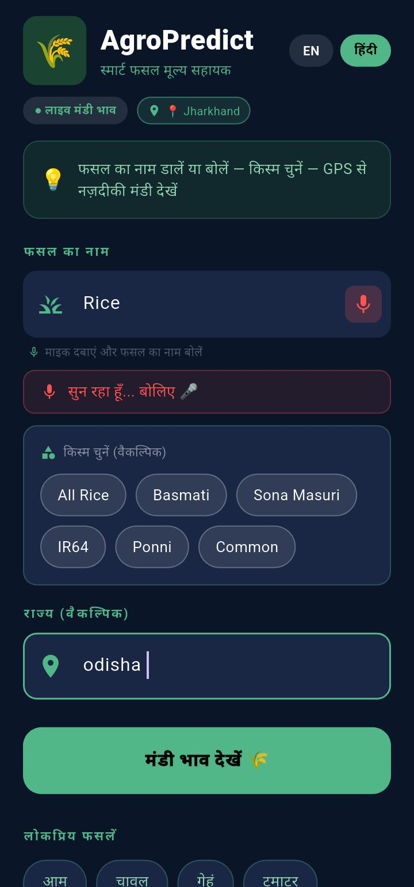
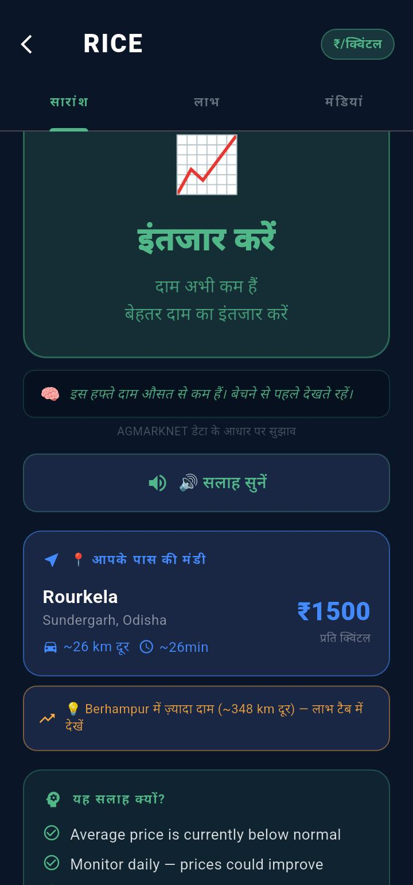
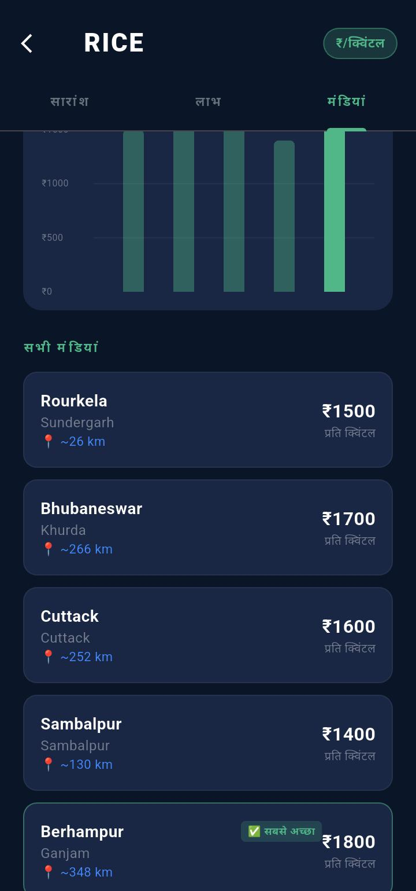
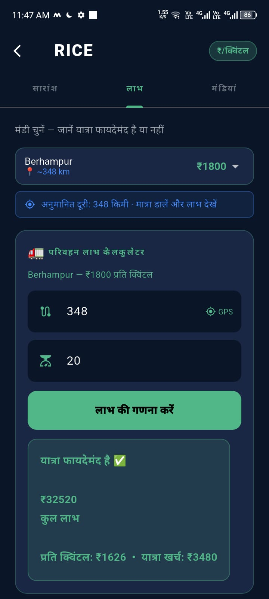
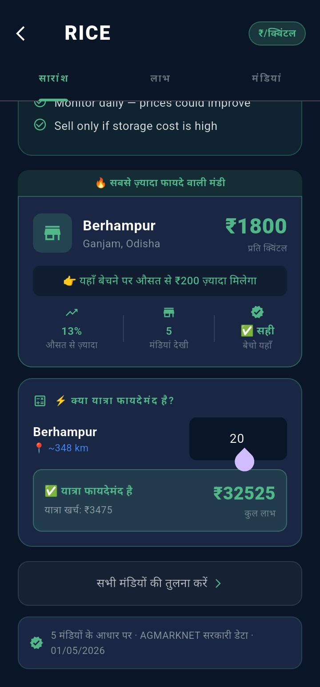

# 🌾 AgroPredict — Smart Crop Price Intelligence
 
> **Built for farmers who sell crops without knowing where the best price is.**
 
[](https://flutter.dev)
[](https://dart.dev)
[](https://agmarknet.gov.in)
[](https://github.com/priya-codesdaily/agropredict/releases)
[](LICENSE)
 
---
 
## 📱 What It Does
 
Most farmers sell crops at their local mandi — not because it's the best price, but because they have no easy way to compare.
 
AgroPredict gives them that comparison.
 
| Feature | What it means for the farmer |
|---|---|
| 📍 GPS Nearest Mandi | Estimates closest mandi using GPS coordinates with approximate distance and travel time |
| 💰 Transport Profit Calculator | "Is it worth the trip?" — calculates net profit after estimated transport cost |
| 🔊 Voice Output | Advice is read aloud in Hindi or English — farmer hears the result without needing to read |
| 🌾 Variety Selection | Rice-Basmati vs Rice-Common — because farmers think in varieties, not just crop names |
| 📊 SELL / WAIT / MONITOR | Simple advice with plain-language reasoning — not just raw numbers |
| 🇮🇳 Full Hindi UI | Complete Hindi interface — every label, button, and result in Hindi |
| 🏪 All Mandis Comparison | See every mandi price side by side with estimated distances and best mandi highlighted |
| 📅 Price Date Shown | Every result shows actual data date — "01/05/2026" not just "today" |
 
---
 
## 🎬 Demo
 
> [Watch the full documentary — 13 farmers, real problem, real app](YOUR_YOUTUBE_LINK_HERE)
 
**Flow:** Enter crop in Hindi → Select variety → GPS finds nearest mandi → See SELL/WAIT advice → Hear result aloud → Calculate transport profit
 
---
 
## 📸 Screenshots
 
| Home (Hindi) | Advice Screen | Markets Tab |
|---|---|---|
|  |  |  |
 
| Profit Calculator | Best Mandi Card |
|---|---|
|  |  |
 
---
 
## 🧠 How the Advice Engine Works
 
```
Input: Crop name + GPS location + quantity
 
→ Fetch live prices from AGMARKNET (Ministry of Agriculture)
→ Find nearby mandis, estimate distance using GPS coordinates
→ Compare current price vs average across available mandis
→ Calculate net profit after estimated transport cost
 
Output:
  🟢 SELL NOW   → Price significantly above average, transport profitable
  🟡 MONITOR    → Price near average, worth checking again in 2-3 days
  🔴 WAIT       → Price below average OR transport cost may exceed gain
 
Note: Advice is rule-based — calculated from live price comparisons.
No ML model used. Farmers should use this as one input, not the only one.
Distance is estimated from GPS coordinates — not real road distance.
```
 
---
 
## 🌱 Origin Story
 
I grew up on the Jharkhand–Odisha border in a farming family.
 
My father grows the crops. My mother handles the selling decisions. Every harvest season, the same question — where do we sell? Local mandi gives one price, but is there better somewhere nearby?
 
I visited farms in Odisha and Jharkhand, sat with farmers, asked them to use the app, and improved it based on what they actually said:
 
- *"Which rice?"* → Crop variety selector added in 24 hours (Basmati / Sona Masuri / Common)
- *"Padhne me dikkat hota hai"* → Voice output added on advice screen — app reads result aloud
- *"Profit nahi hota, mehnat ka faal nahi milta"* → Transport profit calculator built
- *"Kitna kg mein?"* → ₹/quintal ↔ ₹/kg toggle added
Tested with farmers across Odisha and Jharkhand through multiple field visits. A government block office worker in our district reached out independently to test it gave feedback that shaped the V2 roadmap. My mother used the app without any guidance.
 
> This project keeps improving from real farmer feedback — not assumptions.
 
---
 
## 🗺️ Data Source
 
**AGMARKNET — Ministry of Agriculture, Government of India**
 
- 3,000+ mandis across India
- Daily price updates
- Official government data — shown inside the app for transparency
- Free public API
All prices sourced directly from `agmarknet.gov.in`. Actual data date shown on every result screen — farmers know exactly how fresh the price is.
 
> Price update frequency varies by mandi. The app shows the most recently available data and displays the actual date so farmers can judge data freshness themselves.
 
---
 
## 🛠️ Tech Stack
 
```
Language:     Dart
Framework:    Flutter
API:          AGMARKNET (Government of India)
 
Packages:
  geolocator        → GPS location + estimated distance to mandis
  flutter_tts       → Voice output — reads advice aloud in Hindi/English
  speech_to_text    → Voice input on search screen
  fl_chart          → Price comparison bar chart across mandis
  http              → AGMARKNET API calls
  shared_preferences → Local storage
  url_launcher      → WhatsApp share
 
No ML model used — advice is rule-based, calculated from
live price comparisons and transport cost estimates.
```
 
---
 
## 🚀 Getting Started
 
### Prerequisites
- Flutter 3.x installed
- Android device or emulator
- Internet connection for live mandi prices
### Run locally
 
```bash
git clone https://github.com/priya-codesdaily/agropredict.git
cd agropredict
flutter pub get
flutter run
```
 
### Download APK
 
> [Download latest APK](https://github.com/priya-codesdaily/agropredict/releases) — install directly on Android, no Play Store needed
 
---
 
## 🗓️ V2 Roadmap
 
Features planned from ongoing farmer feedback:
 
- [x] Price date transparency — actual date shown on every result (01/05/2026)
- [x] Voice output — advice read aloud in Hindi and English
- [x] Full Hindi UI — every screen translated
- [ ] Smart Selling Score 🟢🟡🔴 — one-glance color decision
- [ ] Shared Transport Calculator — split cost between neighbouring farmers
- [ ] Advanced transport estimator — bike / pickup / truck rates
- [ ] Price history graph — 30-day trend, is price rising or falling
- [ ] Offline mode — cache last known prices for low-connectivity farms
- [ ] Weather-aware insights for perishable crops
- [ ] Odia language support
---
 
## 👩‍💻 Built By
 
**Anshu Priya** — Flutter Developer, BCA Student, Amity University
 
From a farming family on the Jharkhand–Odisha border.
Built this because my parents needed it — my father grows the crops, my mother needed to know where to sell them.
 
[](https://linkedin.com/in/a-priya-dev)
[](https://priya-codesdaily.github.io)
[](mailto:priyatech.logic@gmail.com)
 
---
 
## 📄 License
 
MIT License — see [LICENSE](LICENSE)
 
---
 
<p align="center">
Built with ❤️ for farmers · Tested in real farms · Still improving · Still talking to farmers
</p>
 


